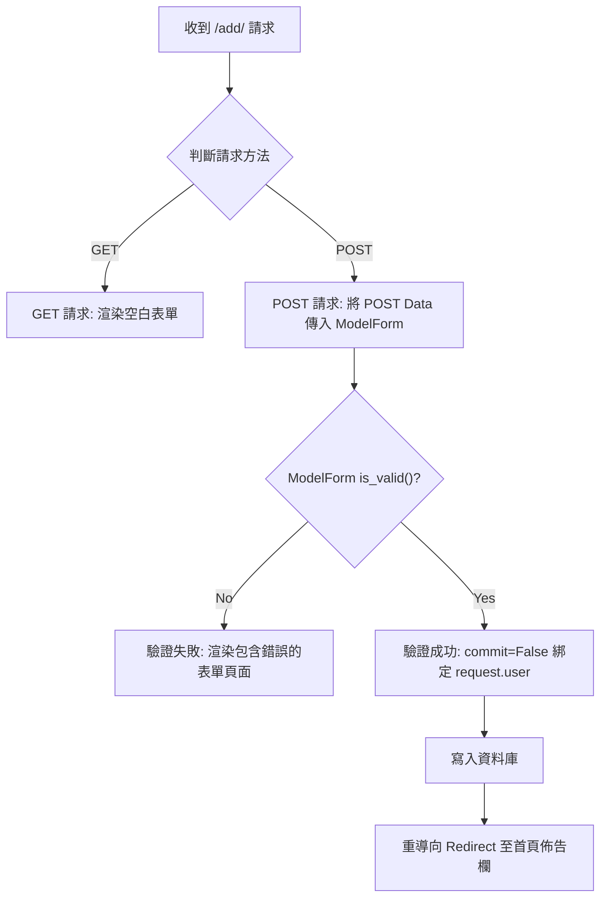

# 校園遺失物管理系統（多容器版）

本專案使用 Docker Compose 建立三層容器架構，並提供網頁介面與 REST API：

- nginx：對外入口與反向代理
- Django + gunicorn：應用程式服務與 REST API 介面
- MySQL 8：資料庫服務

## 系統架構

```text
Browser / Postman
   |
   v
nginx (port 8000) 
   |
   v
web: Django + gunicorn (port 8000)
   |
   v
db: MySQL 8 (port 3306)
```
## 專案重點檔案
- [docker-compose.yml](docker-compose.yml)：定義 db、web、nginx 三個服務與 volumes
- [Dockerfile](Dockerfile)：建置 Django 映像，安裝 Python 套件與 MySQL 依賴
- [nginx/default.conf](nginx/default.conf)：代理到 web 容器，並提供 static 檔
- [config/settings.py](config/settings.py)：支援環境變數，預設使用 MySQL
- [requirements.txt](requirements.txt)：包含 Django、DRF、gunicorn、PyMySQL

## 先決條件

- 已安裝 Docker Desktop（或 Docker Engine + Compose Plugin）
- 可執行 `docker compose` 指令

## 一鍵啟動（多容器）
在專案根目錄執行：
```bash
docker compose up -d --build
```
啟動後：
- 網站入口與 API：http://localhost:8000/
- Django 管理後台：http://localhost:8000/admin/

## 常用操作指令

1. 背景啟動
```bash
docker compose up -d --build
```
2. 停止服務
```bash
docker compose down
```
3. 停止並刪除資料庫資料（會清空 MySQL 內的所有遺失物紀錄與帳號）
```bash
docker compose down -v
```
4. 查看服務狀態
```bash
docker compose ps
```
5. 查看日誌
```bash
docker compose logs -f
```
6. 進入 Django 容器
```bash
docker compose exec web bash
```
7. 建立 Django 管理員與執行資料庫遷移
```bash
docker compose exec web python manage.py migrate
docker compose exec web python manage.py createsuperuser
```

## 服務與環境變數
本專案使用環境變數來保護敏感資料（如資料庫密碼）。為了安全起見，真實的設定檔不會被上傳到 GitHub。

**請在首次啟動專案前，自行建立 `.env` 檔案：**

1. 複製專案提供的範例檔 `.env.example` 並重新命名為 `.env`：
   ```bash
   cp .env.example .env
   ```
2. 打開 `.env` 檔案，並將預設密碼修改為您自己的安全密碼：
   ```env
   MYSQL_DATABASE=lost_found_db
   MYSQL_USER=admin
   MYSQL_PASSWORD=請在此輸入您的密碼
   MYSQL_ROOT_PASSWORD=請在此輸入ROOT密碼
   ```
*(註：請確保 `.env` 已經加入 `.gitignore` 中，絕對不要將包含真實密碼的檔案推送到 GitHub！)*

## 啟動流程（web 容器）

web 服務啟動時會透過 `Dockerfile` 與 `docker-compose.yml` 執行：
1. `gunicorn config.wsgi:application --bind 0.0.0.0:8000`

*(註：首次啟動後，需手動進入容器執行 `python manage.py migrate` 建立資料表。)*

## 資料持久化

- `mysql_data` volume：保存 MySQL 資料 (遺失物清單、會員帳號密碼)。即使重啟 (`docker compose restart`) 或移除容器 (`docker compose down`)，資料亦不會遺失。

## Nginx 行為

[nginx/nginx.conf](nginx/nginx.conf) 目前設定：

- `location /`：將所有 HTTP 請求反向代理到內部的 `web:8000`，並傳遞正確的 Host 與 IP 標頭 (Headers)。

## 本機非容器開發（可選）

如果你要在本機直接跑 Django（不透過 Docker Compose），可切回 SQLite 進行快速測試：

```bash
# 需修改 settings.py 內的 DATABASES 設定回預設 sqlite3
python manage.py makemigrations
python manage.py migrate
python manage.py runserver
```

## 故障排查

1. **網站無法開啟**
   - 執行 `docker compose ps` 檢查是否三個服務 (nginx, web, db) 都在 `Up` 狀態。
   - 執行 `docker compose logs -f nginx web db` 查看是否有錯誤訊息。

2. **Django 無法連線 MySQL 或出現 500 錯誤**
   - 確認 db 容器已經完全啟動並準備好接受連線。
   - 檢查 `settings.py` 內的 `ALLOWED_HOSTS = ['*']` 是否設定正確。
   - 確認 `.env` 內的密碼與 `settings.py` 讀取的變數名稱完全一致。

3. **CSRF 驗證失敗或無法登入**
   - 檢查 HTML 表單內是否有加上 ``。
   - 確認 `settings.py` 已設定 `CSRF_TRUSTED_ORIGINS` (因 Nginx 代理會更改請求來源)。

---

## 專案核心功能與 REST API 端點

本專案不僅包含完整的網頁介面 (註冊、登入、通報遺失物、領取遺失物)，也提供基於 Django REST Framework 的 **唯讀 (Read-Only) API**，供外部應用程式查詢：

| HTTP Method | API 端點 (Endpoint) | 說明 |
| :--- | :--- | :--- |
| `GET` | `/api/items/` | 取得所有狀態為尚未領取 (`is_returned=False`) 的遺失物 JSON 陣列，依時間反序排列 |
| `GET` | `/api/items/<id>/` | 取得特定 ID 的遺失物詳細 JSON 資料 |

### 核心邏輯流程圖 (Web 介面新增遺失物)



---

## 如何將專案上傳到 GitHub

1. [註冊 GitHub 帳號](https://github.com/)（如尚未註冊）。
2. 在 GitHub 建立新 repository（例如：`django-lost-and-found-v3`）。
3. 在本機專案根目錄初始化 Git 並推送：

   ```bash
   git init
   git add .
   git commit -m "Initial commit"
   git branch -M main
   git remote add origin [https://github.com/](https://github.com/)<你的帳號>/<你的 repository>.git
   git push -u origin main
   ```

---

## 在另一台 Docker Host (Windows + WSL) 從 GitHub 下載並執行

1. 安裝 [Git](https://git-scm.com/) 與 [Docker Desktop](https://www.docker.com/products/docker-desktop/)（含 WSL2 支援）。
2. 開啟 WSL 終端機，切換到欲存放專案的目錄。
3. 下載專案原始碼：

   ```bash
   git clone [https://github.com/](https://github.com/)<你的帳號>/<你的 repository>.git
   cd <你的 repository>
   ```

4. **重要：建立環境變數**
   ```bash
   cp .env.example .env
   # 請編輯 .env 填入您的資料庫密碼
   ```

5. 啟動專案（於專案根目錄）：

   ```bash
   docker compose up -d --build
   ```

6. 執行資料庫遷移並建立管理員：
   
   ```bash
   docker compose exec web python manage.py migrate
   docker compose exec web python manage.py createsuperuser
   ```

---

## 在原主機開啟瀏覽器執行 Web 專案

1. 啟動 Docker Compose 與 Migrate 後，於原主機（或同一區網內其他主機）開啟瀏覽器。
2. 輸入網址：

   - 本機端： [http://localhost:8000/](http://localhost:8000/)
   - 其他主機： [http://<Docker Host IP>:8000/](http://<Docker Host IP>:8000/)

3. 若需存取 API 或後台，可前往：
   - API: [http://localhost:8000/api/items/](http://localhost:8000/api/items/)
   - 後台: [http://localhost:8000/admin/](http://localhost:8000/admin/)